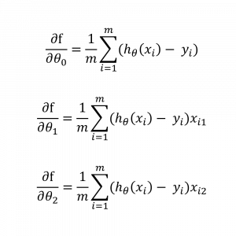

**Kalkulus adalah** alat yang sangat kuat dalam matematika karena membantu kita menganalisis berbagai fenomena, mulai dari perubahan cuaca hingga dinamika ekonomi. Dan tidak hanya itu, materi kalkulus juga sering digunakan dalam pemrograman, fisika, teknik, dan banyak bidang lainnya.

Dalam dunia pemrograman, terutama yang berkaitan dengan **machine learning**, **kalkulus adalah** salah satu dasar utama. Kenapa begitu?

- **Optimisasi Algoritma**: Salah satu penggunaan utama kalkulus dalam pemrograman adalah untuk optimisasi. Misalnya, dalam algoritma machine learning, kita menggunakan kalkulus untuk mencari nilai terbaik dari parameter model. Proses ini sering kali melibatkan pencarian minimum atau maksimum dari suatu fungsi, yang bisa dilakukan dengan menggunakan kalkulus diferensial.
- **Simulasi dan Model Fisik**: Kalkulus juga digunakan dalam simulasi model fisik. Misalnya, ketika kamu membuat simulasi gerak objek dalam permainan video, kalkulus membantu menghitung bagaimana objek tersebut bergerak seiring waktu. Dengan menggunakan rumus kalkulus, kita bisa memodelkan lintasan, kecepatan, dan percepatan objek.

Berikut adalah beberapa konsep dasar yang kamu akan pelajari dalam kalkulus:

1. **Limit**: Konsep limit adalah dasar dari kalkulus. Limit digunakan untuk memahami perilaku fungsi saat mendekati titik tertentu. Sebagai contoh, kamu bisa melihat bagaimana fungsi mendekati nilai tertentu saat variabelnya mendekati batas tertentu.
2. **Turunan (Differensial)**: Seperti yang sudah disebutkan, turunan berkaitan dengan laju perubahan. Contoh klasik adalah bagaimana menghitung laju perubahan suhu atau kecepatan mobil pada waktu tertentu.
3. **Integral**: Integral adalah kebalikan dari turunan. Jika turunan menghitung laju perubahan, maka integral menghitung total akumulasi dari perubahan tersebut. Contohnya adalah menghitung total jarak yang ditempuh berdasarkan kecepatan.
4. **Persamaan Diferensial**: Ini adalah aplikasi lanjut dari turunan dan integral. Persamaan diferensial digunakan untuk memodelkan berbagai fenomena dunia nyata seperti penyebaran penyakit, perubahan populasi, dan bahkan gelombang suara.

[`Klik Disini untuk Download Materi PDF`](Matematika-Kalkulus.pdf)
